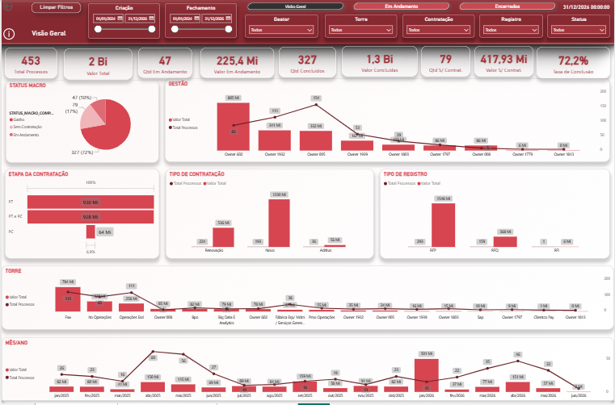
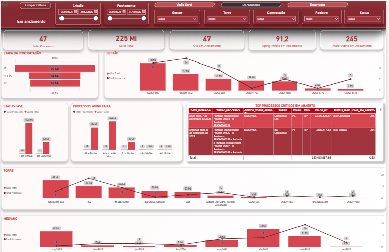
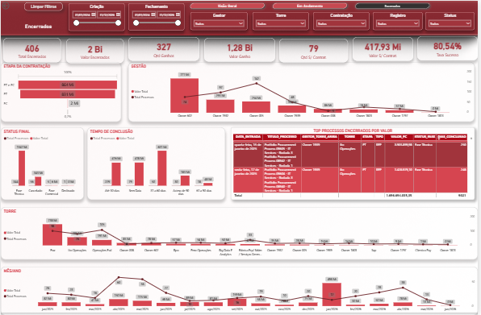
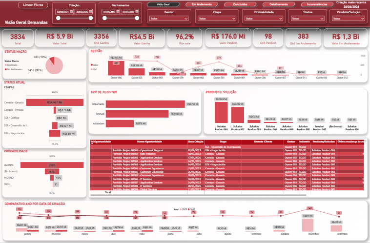
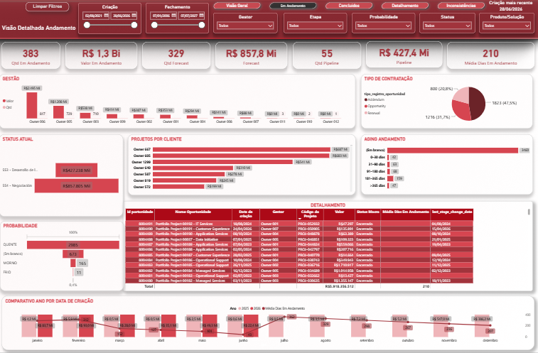
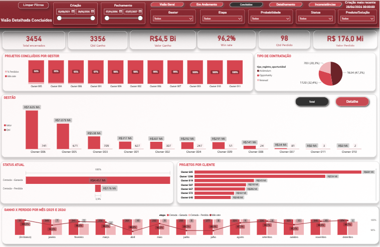

# Power BI - Compras, Demandas e Comparativo 
## Sobre o Projeto

Este projeto apresenta um conjunto de dashboards desenvolvidos em **Power BI** para análise executiva de **Compras**, **Demandas** e do **comparativo entre as duas bases**.

O objetivo é transformar dados operacionais em indicadores executivos para acompanhamento de carteira, análise de status, processos em andamento, processos encerrados, ganhos, perdas, inconsistências cadastrais e cobertura entre bases.

O projeto foi estruturado com foco em portfólio profissional, utilizando dados anonimizados/adaptados e relatórios publicados no Power BI Service.

---

## Acessar os Dashboards Publicados

| Dashboard | Descrição | Link |
|---|---|---|

| Relatório de Demandas | Painel executivo para análise da carteira de demandas, oportunidades, ganhos, perdas, andamento, probabilidade e produtos/soluções. | [Acessar Dashboard](https://app.powerbi.com/view?r=eyJrIjoiNWRhNTEzODAtNjViYS00MjVkLTgxM2QtMDM5ZjAzM2EyMzJkIiwidCI6IjY1OWNlMmI4LTA3MTQtNDE5OC04YzM4LWRjOWI2MGFhYmI1NyJ9) |
| Relatório de Compras | Painel executivo para análise de processos de compras, ganhos, andamento, sem contratação, aging, encerrados e valor financeiro. | [Acessar Dashboard](https://app.powerbi.com/view?r=eyJrIjoiODk4MTBhYjctYjY1MC00MjQ3LWJhMDgtZWM3NDc4MWEwOTBmIiwidCI6IjY1OWNlMmI4LTA3MTQtNDE5OC04YzM4LWRjOWI2MGFhYmI1NyJ9) |
| Comparativo Compras x Demandas | Painel para análise de cobertura cadastral entre processos de Compras e a base de Demandas. | [Acessar Dashboard](https://app.powerbi.com/view?r=eyJrIjoiODc2YmYyYjAtNjA0Mi00NGY3LWE5ZTktNzE4YWEzYzUzMGUzIiwidCI6IjY1OWNlMmI4LTA3MTQtNDE5OC04YzM4LWRjOWI2MGFhYmI1NyJ9) |
> Observação: os dashboards foram publicados com dados anonimizados/adaptados para fins de portfólio. As bases originais e arquivos PBIX não são disponibilizados publicamente.

---

## Dashboards Desenvolvidos

O projeto é composto por três frentes principais:

1. **Relatório de Compras**
2. **Relatório de Demandas**
3. **Comparativo Compras x Demandas**

Cada dashboard possui um objetivo específico, mas todos seguem a mesma proposta: transformar dados operacionais em indicadores claros para apoiar análise, acompanhamento e tomada de decisão.

---

# 1. Relatório de Compras

## Objetivo

O Relatório de Compras acompanha processos formais de contratação, cotação, negociação ou aquisição.

A carteira de compras foi organizada em três grupos principais:

- **Ganho**
- **Em Andamento**
- **Sem Contratação**

A visão permite acompanhar processos abertos, encerrados, valor financeiro, responsáveis, torres, tipos de contratação, tipos de registro, aging e taxa de conclusão.

---

## Principais Análises

- Total de processos de compras
- Valor total da carteira
- Processos em andamento
- Valor em andamento
- Processos ganhos
- Valor ganho
- Processos sem contratação
- Valor sem contratação
- Taxa de conclusão
- Aging médio dos processos em aberto
- Maiores processos críticos
- Processos encerrados por valor
- Distribuição por gestor, torre, etapa, contratação e registro

---

## Prints do Relatório de Compras

### Compras - Visão Geral



### Compras - Em Andamento



### Compras - Encerrados



---

# 2. Relatório de Demandas

## Objetivo

O Relatório de Demandas apresenta uma visão executiva da carteira de demandas, oportunidades, projetos ou necessidades registradas para acompanhamento.

O painel permite acompanhar demandas ganhas, perdidas e em andamento, além de valor financeiro, win rate, probabilidade, produto/solução, gestores, etapas e evolução mensal.

---

## Principais Análises

- Total de demandas
- Valor total da carteira
- Quantidade ganha
- Valor ganho
- Quantidade perdida
- Valor perdido
- Quantidade em andamento
- Valor em andamento
- Win rate
- Probabilidade da demanda
- Tipo de registro
- Produto ou solução
- Evolução mensal por ano
- Detalhamento das oportunidades

---

## Prints do Relatório de Demandas

### Demandas - Visão Geral



### Demandas - Em Andamento



### Demandas - Concluídos



---

# 3. Comparativo Compras x Demandas

## Objetivo

O Comparativo Compras x Demandas tem como objetivo medir a cobertura cadastral entre os processos de Compras e a base de Demandas.

A análise permite identificar quais processos de Compras foram localizados em Demandas, quais não foram encontrados, quais existem apenas na base de Demandas e quais possuem inconsistências cadastrais.

---

## Diferença entre Compras e Demandas

**Demandas** representam oportunidades, necessidades, projetos ou iniciativas cadastradas para acompanhamento da carteira.

**Compras** representam processos formais de contratação, cotação ou aquisição relacionados a essas necessidades.

De forma simples:

```text
Demandas = oportunidades, necessidades ou projetos acompanhados.
Compras = processos formais de contratação, cotação ou aquisição.
---

## Autor

Alexander Albuquerque

Profissional de Dados, BI, Automação e Eficiência Operacional, com foco em transformar dados complexos em indicadores executivos, apoiar a tomada de decisão e melhorar a visibilidade operacional por meio de dashboards e análises estruturadas.
